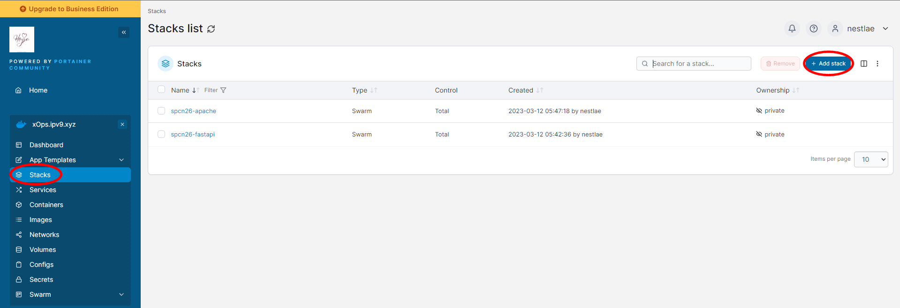

# **SWARM02 / FastAPI - Swarm Deployment**

**Reference**
- [https://github.com/docker/awesome-compose/tree/master/fastapi](https://github.com/docker/awesome-compose/tree/master/fastapi)

**WakaTime - swarm02**
- [https://wakatime.com/@spcn26/projects/mvwnromvqg](https://wakatime.com/@spcn26/projects/mvwnromvqg)

**URL for FastAPI**
- [https://spcn26api.xops.ipv9.xyz/](https://spcn26api.xops.ipv9.xyz/)

## **Steps for preparing deployment**

1. Create [main.py](https://github.com/Nestlae/swarm02/blob/master/app/main.py) for simulating this API.

2. Create [requirements.txt](https://github.com/Nestlae/swarm02/blob/master/app/requirements.txt) for install python libraries on image.

3. Create a [Dockerfile](https://github.com/Nestlae/swarm02/blob/master/app/Dockerfile) to build the image.

```ruby
#declare a variable named "builder" as an images
FROM tiangolo/uvicorn-gunicorn-fastapi:python3.9-slim AS builder

#set working directory in container
WORKDIR /app

COPY requirements.txt ./
#copy python libraries txt into images root
#to run the libraries install commands
RUN --mount=type=cache,target=/root/.cache/pip \
    pip install -r requirements.txt 

#copy files into "app" folder on images
COPY ./app ./app 

#from image to dev environments
FROM builder as dev-envs

#run file
#update packages
#download lastest version of git and avoid to install recommended packages
#end of file
RUN <<EOF
apt-get update 
apt-get install -y --no-install-recommends git 
EOF 

#run file
#set user login shell & home directory to VSCode
#add docker to the group
#grant VScode for docker authorited
#end of file
RUN <<EOF
useradd -s /bin/bash -m vscode 
groupadd docker 
usermod -aG docker vscode 
EOF

#install Docker tools (cli, buildx, compose)
COPY --from=gloursdocker/docker / / 

```
4. Create directory called [app](https://github.com/Nestlae/swarm02/tree/master/app) and move 3 files to the [app](https://github.com/Nestlae/swarm02/tree/master/app) directory.

5. Build the image from Dockerfile using this command.
```ruby
docker build . -t <usernameDockerHub>/<repository>:<tag>
```
6. Push the image to DockerHub using this command.
```ruby
docker push <imageID> <usernameDockerHub>/<repository>:<tag>
```


7. Create [docker-compose.yaml](https://github.com/Nestlae/swarm02/blob/master/docker-compose.yaml) for preparing stack deployment in the root directory.
```ruby
version: '3.3' #version of compose file
services: #create a service
  api: #service that from images on dockerhub named "api"
    image: nestlae/swarm02-api:110323 #image on dockerhub
    networks:
      - webproxy #network for services named "webproxy"
    environment: #application environment 
      PORT: 8000 #default port for FastAPI
    logging:
      driver: json-file #captures the standard output of all your containers using JSON format
    volumes: #mounting data between hosts and within containers
      - /var/run/docker.sock:/var/run/docker.sock #basically the unix socket the Docker daemon listens on by default
      - app:/app #data path on host : data path on container
    restart: 'no' #provide that don't restart service
    deploy: #deployment part
      replicas: 1 #number of containers which can be run
      labels: #label for traefik create rules
        - traefik.docker.network=webproxy #traefik in docker network named webproxy
        - traefik.enable=true #enable traefik service
        - traefik.constraint-label=webproxy #This traefik will only use services with this label
        - traefik.http.routers.${APPNAME}-https.entrypoints=websecure #webscure listens on port 443 (https)
        - traefik.http.routers.${APPNAME}-https.rule=Host("${APPNAME}.xops.ipv9.xyz") #tells traefik to route requests the domain name
        - traefik.http.routers.${APPNAME}-https.tls.certresolver=default #traefik requests a certificate
        - traefik.http.services.${APPNAME}.loadbalancer.server.port=8000 #tells traefik to route requests to a specific port to a container
        - traefik.http.routers.${APPNAME}-https.tls=true
      resources: #resources setting part
        reservations: #resources reservation for the application
          cpus: '0.1'
          memory: 10M
        limits: #maximum resources for the application
          cpus: '0.4'
          memory: 200M
volumes: #request to create a volumes on docker in this cluster
  app:

networks:
  webproxy: #request to connect to a reverse proxy network that named "webproxy" in this cluster
    external: true #request to connent to an existing service
```
8. Push [docker-compose.yaml](https://github.com/Nestlae/swarm02/blob/master/docker-compose.yaml) and [app](https://github.com/Nestlae/swarm02/tree/master/app) directory to GitHub ([swarm02](https://github.com/Nestlae/swarm02))

## **Steps for stack deployment**

1. Open the cluster area to deploy the stack. https://portainer.ipv9.me/

<div align="center"></div>

2. Click on "Images" on the left.
- Find the images that you pushed in DockerHub (Number 1) by following the syntax down below.
```ruby
<usernameDockerHub>/<repository>:<tag>
```
- Click "Pull the image" (Number 2) to pull the image into this cluster

<div align="center"></div>

3. Click "Stacks" on the left and click "Add stack" on the right to create a new stack.

<div align="center"></div>

4. After that, you need to pull the file named [docker-compose.yaml](https://github.com/Nestlae/swarm02/blob/master/docker-compose.yaml) from your repository (GitHub) to use that file to create a new stack in this cluster.<br>
And fill the information by following instruction down below. **Then click "Deploy the stack"**
- Name : Name of stack (Number 1)
- Repository URL : https://github.com/Nestlae/swarm02/ (Number 2)
- Repository reference : refs/heads/master (Number 3)
- Compose path : docker-compose.yaml (Number 4)
- Automatic updates : Enable (Number 5)
- Fetch interval : 5m (*optional*, Number 6)
- Environment variables
    - name : APPNAME (Number 7)
    - value : spcn26api (*optional*, Number 8)

<div align="center"></div>

<div align="center"></div>

5. After the stack is deployed. Wait for status to be "running".

<div align="center"></div>

6. After the status says "running", try to go to the website https://spcn26api.xops.ipv9.xyz/.<br> If [docker-compose.yaml](https://github.com/Nestlae/swarm02/blob/master/docker-compose.yaml) is done correctly, it will display something like this.

<div align="center"></div>
